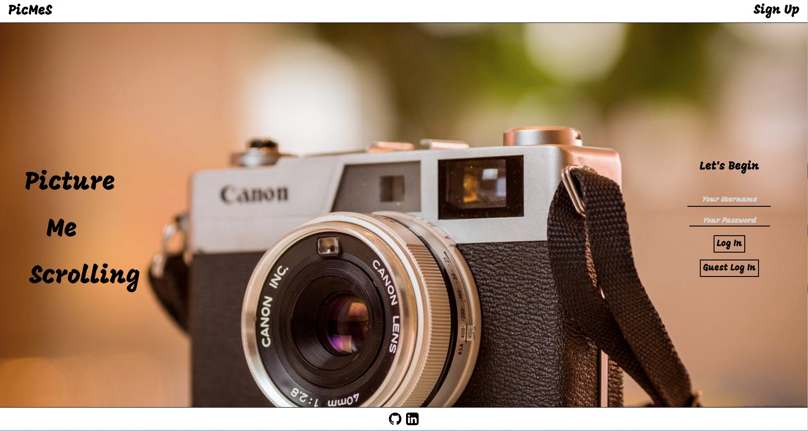
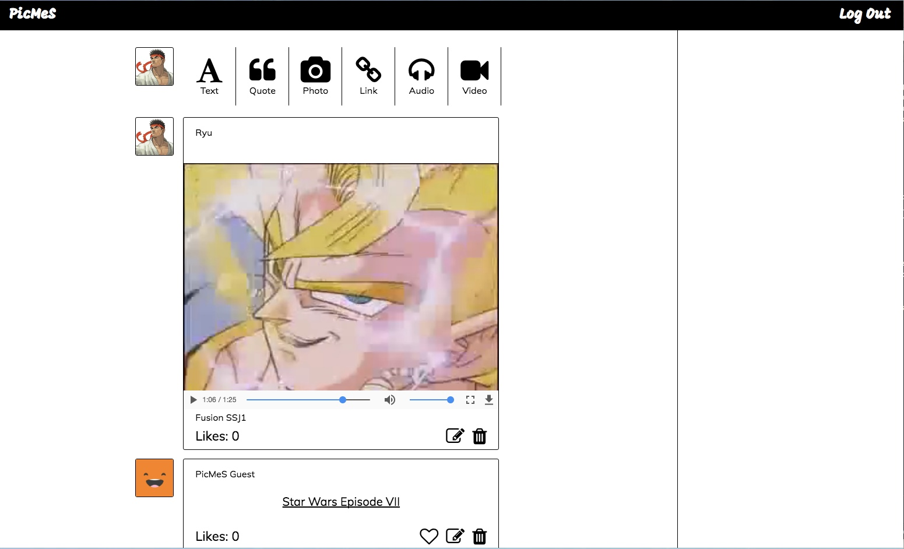

# Picture Me Scrolling (PicMeS)

Picture Me Scrolling, a Tumblr inspired clone, is a blogging site (that creates an outlet for users to share their views through a variety of mediums including text, audio and visual. A single page application built with Ruby on Rails and React/Redux, along with PostgreSQL.  PicMeS also lets the user experience the world through the experiences of others.



## Technology

In addition to the aforementioned tech, this site was also developed using:

+ **Heroku** - for website hosting.
+ **Npm** - to install varying modules for front-end development.
+ **Paperclip** - file attachments to posts.
+ **Amazon Web Services** - to store uploaded data from users.
+ **Figaro** - used to secure API keys provided as security access to AWS

## Features

+ Secured website use via front-end and back-end authentication.
+ Blog posts of various types that include text, links, music/audio and videos.
  + a preview of video and images are displayed for the users

```js
  handleMedia(e) {
    let reader = new FileReader();
    let file = e.currentTarget.files[0];
    reader.onloadend = function() {
      this.setState({
        imageUrl: reader.result,
        imageFile: file
      });
    }.bind(this);

    if (file) {
      reader.readAsDataURL(file);
    }
  }
```

The handleMedia function allows for this preview feature via **FileReader**. A new FileReader object is instantiated, a success function is set for when it loads and followed by a reading the file with **FileReader#readAsDataURL(file)**
An image preview is displayed with use of the imageURL.


```js
  handleSubmit(e) {
    let formData = new FormData();
    formData.append('post[url]', this.state.url);
    formData.append('post[title]', this.state.title);
    formData.append('post[post_type]', 'photo');
    formData.append('post[body]', this.state.body);
    formData.append('post[image]', this.state.imageFile);
    this.props.createMediaPost(formData)
      .then(this.closeModal());
  }
  ```

For image uploading, we append key/value pairs via the **append** method to a FormData object. This object is used to send data to the server using an AJAX request. this.state.imageFile holds the file of respective type. Also to note, the **post_type** info appending to the object is used to indicate the type of post being created. This info also aids with rendering posts on the feed since correct tags must be used to display each media type.


+ Posts are presented on a Feed which also includes a blogger's avatar.


## Future Development Plans

### User Blog Page
A display of on the current user's blog posts.

### Reblog Post
Grants users the ability to share/reblog another user's post on their respective feed.

### Follows
Users will be able to follow specific users whose posts will appear on their feed. Sample list of followees will appear on the dashboard's right column.

### Tags
One word descriptions of the post that will allow users to view all posts that have the same tag.
