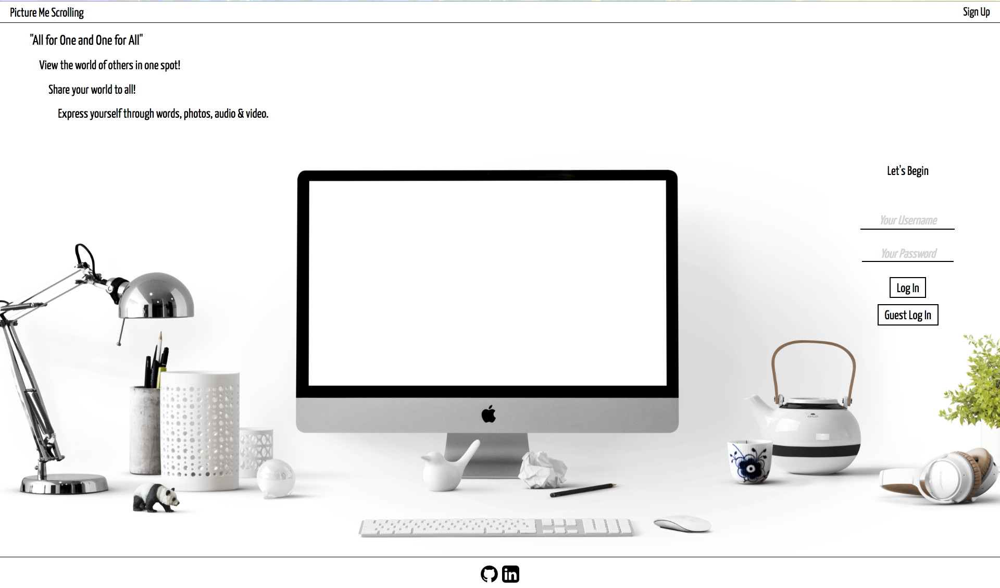
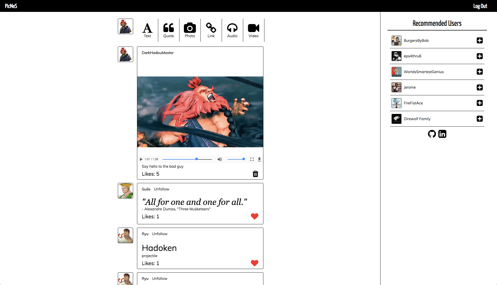

# Picture Me Scrolling (PicMeS)

Picture Me Scrolling, a Tumblr inspired clone, is a blogging site that creates
an outlet for users to share their views through text, audio, images, and video.
It is a single page application built with Ruby on Rails, React, PostgreSQL,
TanStack Query, and Active Storage-compatible media handling. PicMeS also lets
users experience the world through the experiences of others.



## Technology

In addition to the aforementioned tech, this site was also developed using:

+ **React** - frontend UI.
+ **TanStack Query** - server/API state and mutation handling.
+ **Webpack/Babel** - current JavaScript build pipeline.
+ **Active Storage** - media attachment support.
+ **Amazon S3** - media storage.
+ **Figaro** - application configuration.

## Frontend Development

The frontend build is currently handled by Webpack and Babel. Use the Node
version in `.nvmrc` before installing packages or running build commands.

```sh
nvm use
npm install
npm run build
```

For active frontend work, run the watcher:

```sh
npm run build:watch
```

The Rails app serves the compiled JavaScript bundle from
`app/assets/javascripts/bundle.js`.

## Features

+ Secured website use via front-end and back-end authentication.
+ Blog posts of various types that include text, links, music/audio and videos.
  + a preview of video and images are displayed for the users

```js
const handleMedia = e => {
  const file = e.currentTarget.files[0];
  const reader = new FileReader();

  reader.onloadend = () => {
    setImageUrl(reader.result);
    setImageFile(file);
  };

  if (file) {
    reader.readAsDataURL(file);
  }
};
```

The handleMedia function allows for this preview feature via **FileReader**. A new FileReader object is instantiated, a success function is set for when it loads and followed by a reading the file with **FileReader#readAsDataURL(file)**
An image preview is displayed with use of the imageURL.


```js
const handleSubmit = e => {
  e.preventDefault();

  const formData = new FormData();
  formData.append('post[url]', url);
  formData.append('post[title]', title);
  formData.append('post[post_type]', 'photo');
  formData.append('post[body]', body);
  formData.append('post[image]', imageFile);

  createMediaPost.mutate(formData);
};
```

For image uploading, key/value pairs are appended to a **FormData** object and
sent through the shared fetch API client. The `post_type` field identifies the
type of post being created and helps the feed render the right media component.


+ Posts are presented on a Feed which also includes a blogger's avatar.


## Future Development Plans

### User Blog Page
A display of on the current user's blog posts.

### Reblog Post
Grants users the ability to share/reblog another user's post on their respective feed.

### Follows
Users will be able to follow specific users whose posts will appear on their feed. Sample list of followees will appear on the dashboard's right column.

### Tags
One word descriptions of the post that will allow users to view all posts that have the same tag.

#### Credit
Television graphic by <a href="https://thenounproject.com/daniela.baptista">tnp_daniela_baptista</a> from <a href="https://thenounproject.com/">TheNounProject</a> is licensed under <a href="http://creativecommons.org/licenses/by/3.0/" title="Creative Commons BY 3.0">CC BY 3.0</a>. Check out the new logo that I created on <a href="http://logomakr.com" title="Logo Maker">LogoMaker.com</a> https://logomakr.com/3S4yfl3S4yflÂ
